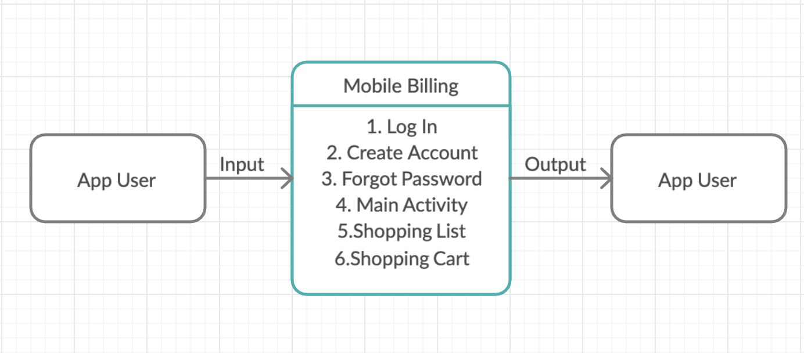

# Mobile-Billing App
 
The main purpose of this application is to reduce the wait time near the billing counter in the grocery stores. We have developed a “Mobile Billing” application that will help you to automatically scan the products that you want to purchase by using QR code scanner that is inbuilt in this application and make the payments for the purchase. This application can be used by customers for self checkout while shopping. The customer downloads the app from the Android Marketplace (Play Store) and scans the items for self checkout without waiting in line to bill items in their cart. It's like having a personal checkout assistant with you always!

 

### Functional Requirement

- Scan a barcode/QR code on the product
- Identify the product and price
- Add/Modify Shopping cart items
- Calculate the sub-totals, taxes and total price
- Accept payment and complete purchase

### User Requirements
- Mobile Device
- Android OS
- Application installed and compatible with user's android version

### Database Design

For this Application we have used the Google Firebase Realtime Database. The Firebase Realtime Database is a cloud-hosted NoSQL database that lets you store and sync data between your users in realtime. Realtime syncing makes it easy for your users to access their data from any device, be it web or mobile. Realtime Database also helps your users collaborate with one another. 
 
In this NoSQL database, we have created some columns such as description, id, imageURL, name and price where each individual column has its own individual action performed in the database.
 
- Description:  It gives a brief introduction about the item.
- id: It is a primary key.
- imageURL : This acts as an image source for the products.
- Name : Name of the product.
- Price : Price of the product.
 
- Database Structure 
 

### App Features

#### Workflow

- Secure access with account/Google authentication
- QR Code Scanning
- Display available products
- Add/Remove products in cart
- Track billing/invoice information, Order Summary

#### Payables

- Access your payment history
- Checkout quickly and easily
- Multiple payment options

### Receivables

- Manage products and customer
- Create invoice
- Keep track of payments received

### DFD Diagrams

- DFD level-0

- DFD level-1

### App Modules and their responsibilities

#### 1. Login Page

- The main responsibility of this module is to provide authentication to App user.
- While running the App this module is considered as a home module.
- User can login using either with App mail or by sign in with google.

#### 2. Reset Password

- In this module when the user forgets his/her password he can go into this module.
- In this module it will ask users to provide their email id for the password recovery.
- After the password has been generated they will directed to the Main Activity module.

#### 3. Create Account

- When the user is a new one he/she can create his own account by opting this module.
- When the user clicks the Sign up button he is directed to this module.
- In this module he can create an account by providing his first name, last name, email and password.
- A verification email is sent to the User to verify the account.

#### 4. Main Activity

- After authentication of the user he/she will be directed to the main activity module.
- User can scan the shopping items by clicking the Scan QR code button or else he can manually select the products by clicking   the Products button.

#### 5. Shopping List

- In this module there will be a grid of shopping items where user will select them and add it to the cart.
- This module is responsible to display all the available items in the store and update whenever it is needed. 
- User can update and delete the items whenever he/she needed.

#### 6. Shopping Cart

- This module is responsible for displaying user’s selected shopping items in the shopping list module.
- Responsible for showing the quantity of the selected items.
- Responsible for calculating the total price of the shopping items.
- Responsible for sharing the receipt to your friends via mail, Whatsapp etc.

